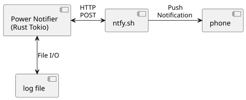

# Power Notifier in Rust and Tokio

# Introduction
I occasionally have a need to store medication in the refrigerator.
Power monitoring is important when there is no battery backup for the refrigerator.
Without monitoring or backup, the efficacy of the medication is questionable.
I have a small low-power home media server NAS device that should be able to help with this.
Use this at your own risk.

# Goals
* phone notification when power goes out or is restored
* timestamps for power events
* ability to estimate how long power was out
* no batteries or power circuit instrumentation
* use Rust and Tokio to continue my learning and sharpen my skills

# Initial Proof of Concept
A partial solution would be to use https://ntfy.sh to send a notification from a script after boot.
For example: 
```curl -d "$(date)" http://ntfy.sh/personal-url-for-power-notifier```

But to estimate how long power was out, we need periodic logging while the system is running.
And I don't want to implement this with curl or a script.

# Notification
The notification has:
* hostname or machine id
* timestamp when power was restored
* timestamp from power on log

For example:
```raspi5 P 2026-02-01 17:07:13 L 2026-02-01 17:05:05```

# Implementation
I used Rust and Tokio to build a small daemon that runs when the system boots.
The daemon can started with systemd, launchd, or a variety of other methods depending on the target system.
Here is a diagram of the daemon and everything it interacts with.



# CLI Arguments
CLI arguments are:
* hostname or machine identifier
* path to log/state file
* ntfy.sh url

# Behavior
The program attempts to read from the power log file, it builds the notification string, and then it attempts to send the notification.
It retries sending the notification once per minute in case the network is down, etc.

The program writes a new timestamp to the power log file after successfully sending the noification and once per hour after that.

Power outage duration can be estimated within an hour.

